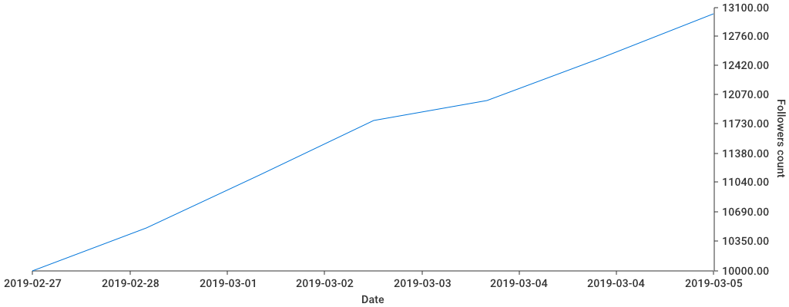

# Lambda Instagram Followers Chart

## Requirements

* AWS CLI already configured with at least PowerUser permission
* [AWS SAM installed](https://docs.aws.amazon.com/lambda/latest/dg/serverless_app.html)
* [Docker installed](https://www.docker.com/community-edition)
* [Golang (v1.12)](https://golang.org)

### Local development
You need to have DynamoDB local](https://hub.docker.com/r/amazon/dynamodb-local).
```
docker run -d -p 8000:8000 amazon/dynamodb-local
```

SAM local doesn't evaluate CloudFormation conditionals so you must create DynamoDB Tables by yourself:
```
aws dynamodb create-table --endpoint-url http://localhost:8000 --table-name logs-table --attribute-definitions AttributeName=time,AttributeType=S AttributeName=username,AttributeType=S --key-schema AttributeName=username,KeyType=HASH AttributeName=time,KeyType=RANGE --provisioned-throughput ReadCapacityUnits=1,WriteCapacityUnits=1
```

```
aws dynamodb list-tables --endpoint-url http://localhost:8000
```

```
make build && sam local invoke ScraperFunction --log-file ./out.log --env-vars env.json --no-event
```

### Sample graph
